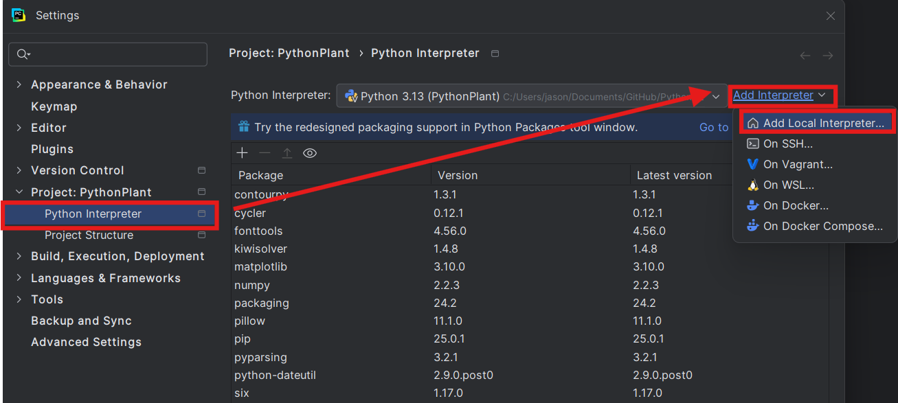
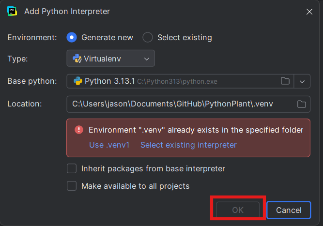

# PythonPlant

## Task List
_Please reach out to Zenyn for clarification on any of the tasks below._
### Important and Urgent (I)
- [ ] Determine theoretical unit testing criteria
  - How can we determine if the programs is doing something wrong?
### Important but Not Urgent (II)
- [ ] Test optimize parameters based on experimental data
- [ ] Add input validation to all functions (ex: no negative mass)
- [ ] Add graphing for real position
  - think about how we can visualize and calculate for difference reference frames
### Not Important but Urgent (III)
- [ ] (Graphing) Add Legends
- [ ] (Graphing) Add Units
- [ ] (Graphing) Fix title cutoff
### Not Important or Urgent (IV)
- [ ] Fix rotational positioning issue
  - Angle should not exceed two-pi

## Setup 
*The following instructions are for using [PyCharm](https://www.jetbrains.com/pycharm/download/?section=windows) which has a student license which you can activate*
- Install PyCharm using the link above
- After start up clone the repository using the built-in tools on PiCharm
- Once you open your project, go to `Settings > Project > Python Interperter > Add Interpreter > Add Local Interperter `

- Don't change any of the default settings, and click `Okay` 
- After Python has successfully been installed, run the following commands in the PyCharm integrated terminal to install `numpy` for math and `matplotlib` for plotting.
```bash
pip install numpy
pip install matplotlib
```
- After both have sucessfully installed, you should be ready to run the code!